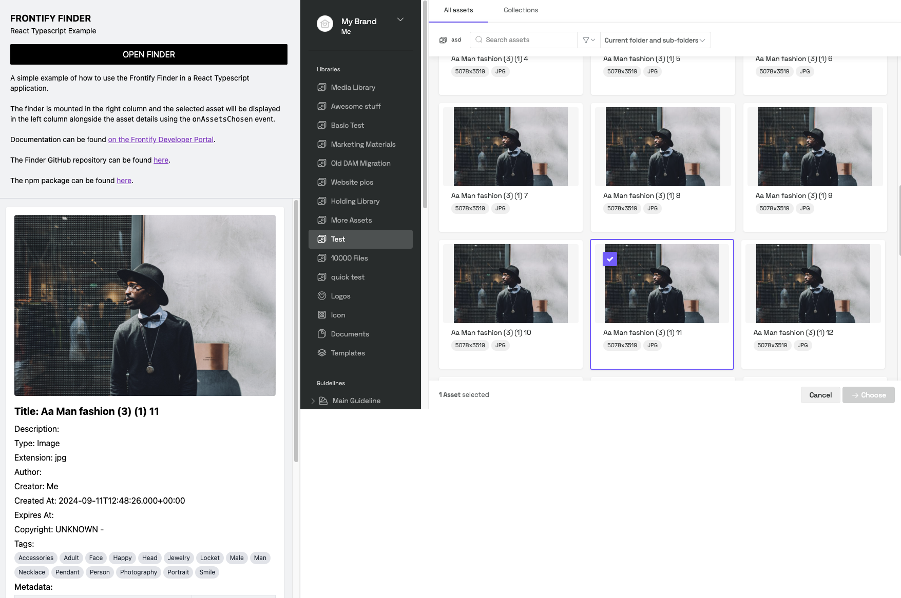

# Frontify Finder Examples

A repository showcasing simple usage examples of the Frontify Finder, using React and Vue, with Typescript and Tailwind.

The original [Frontify Finder repository](https://github.com/Frontify/frontify-finder "Frontify Finder") and the [Frontify Finder npm package](https://www.npmjs.com/package/%40frontify/frontify-finder) can be found on their respective links.

The official documentation can be found on [Frontify's Developer Portal](https://developer.frontify.com/ "Frontify's Developer Portal")

